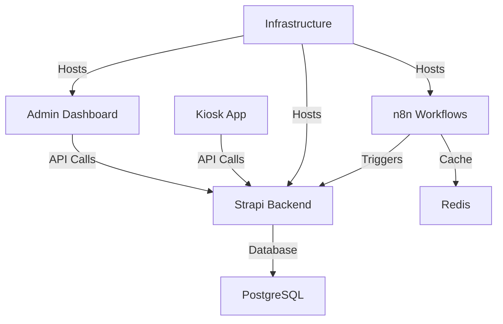

# Registry: Components

> **File**: `.obsidient/registry/components.md`
> **Purpose**: Registry of all project components with method mappings

---

## Component Registry

### n8n Workflows

```yaml
name: n8n Workflows
path: workflows/
tech:
  - n8n 2.9.4
  - JSON
  - JavaScript
status: active
owner: automation-team
entry_points:
  - W4_CORE.json
  - W_QUEUE_METRICS.json
  - W_AUDIT_WRITE.json
dependencies:
  - redis
  - postgresql
  - strapi-backend
methods:
  bmad:
    usage: Plan workflow logic, data flow design
    skills:
      - create-architecture
      - implementation-readiness
  gsd:
    usage: Direct workflow edits, hotfixes
    skills: []
  ralphe:
    usage: Automated workflow generation, testing
    skills:
      - create-story
      - qa-automate
obsidient_sync:
  - workflow_changes
  - execution_logs
  - error_patterns
```

---

### Admin Dashboard

```yaml
name: Admin Dashboard
path: admin-dashboard/
tech:
  - React 18
  - Vite
  - TypeScript
  - Tailwind CSS
status: active
owner: frontend-team
entry_points:
  - src/App.tsx
  - src/main.tsx
  - src/pages/AdminLayout.tsx
dependencies:
  - strapi-backend
  - n8n-workflows
methods:
  bmad:
    usage: UX design, component architecture
    skills:
      - create-ux
      - create-architecture
  gsd:
    usage: UI fixes, component updates
    skills:
      - quick-dev
  ralphe:
    usage: Feature implementation, refactoring
    skills:
      - create-story
      - qa-automate
obsidient_sync:
  - component_changes
  - bundle_metrics
  - test_coverage
```

---

### Kiosk App

```yaml
name: Kiosk App
path: kiosk-app/
tech:
  - React 18
  - Vite
  - TypeScript
  - PWA
status: active
owner: frontend-team
entry_points:
  - src/App.tsx
  - src/menuService.ts
dependencies:
  - strapi-backend
  - payment-gateway
methods:
  bmad:
    usage: UX design for kiosk flow
    skills:
      - create-ux
  gsd:
    usage: Quick UI updates
    skills:
      - quick-dev
  ralphe:
    usage: Feature development
    skills:
      - create-story
obsidient_sync:
  - component_changes
  - offline_capabilities
```

---

### Strapi Backend

```yaml
name: Strapi Backend
path: cms/
tech:
  - Strapi 4
  - PostgreSQL
  - Node.js
  - GraphQL
status: active
owner: backend-team
entry_points:
  - src/api/
  - config/
  - database/
dependencies:
  - postgresql
  - redis
methods:
  bmad:
    usage: API design, data modeling
    skills:
      - create-architecture
      - technical-research
  gsd:
    usage: API fixes, content type updates
    skills:
      - quick-dev
  ralphe:
    usage: API development, optimization
    skills:
      - create-story
obsidient_sync:
  - api_changes
  - schema_migrations
  - performance_metrics
```

---

### Infrastructure

```yaml
name: Infrastructure
path: infra/
tech:
  - Docker
  - Docker Compose
  - Nginx
  - Redis
  - PostgreSQL
status: active
owner: devops-team
entry_points:
  - docker-compose.hostinger.prod.yml
  - docker-compose.base.yml
  - infra/gateway/nginx.conf
dependencies: []
methods:
  bmad:
    usage: Architecture design, infrastructure planning
    skills:
      - create-architecture
  gsd:
    usage: Config updates, hotfixes
    skills:
      - quick-dev
  ralphe:
    usage: Infrastructure as code, automation
    skills:
      - create-story
obsidient_sync:
  - config_changes
  - deployment_logs
  - health_checks
```

---

### Documentation

```yaml
name: Documentation
path: docs/
tech:
  - Markdown
  - Mermaid
  - OpenAPI
status: active
owner: tech-writer
try_points:
  - ARCHITECTURE.md
  - API.md
  - RUNBOOK.md
dependencies: []
methods:
  bmad:
    usage: Documentation planning
    skills:
      - create-prd
      - create-architecture
  gsd:
    usage: Quick doc updates
    skills:
      - quick-dev
  ralphe:
    usage: Auto-generated docs
    skills:
      - create-story
obsidient_sync:
  - doc_changes
  - api_specs
```

---

### WhatsApp Bot Integration

```yaml
name: WhatsApp Bot
path: workflows/ + integrations/whatsapp/
tech:
  - n8n
  - WhatsApp Business API
  - Meta Webhooks
status: planned
owner: automation-team
entry_points:
  - W4_CORE.json (webhook handler)
  - integrations/whatsapp/
dependencies:
  - n8n-workflows
  - strapi-backend
methods:
  bmad:
    usage: Integration design, webhook planning
    skills:
      - create-architecture
      - create-prd
  gsd:
    usage: Webhook debugging, message templates
    skills: []
  ralphe:
    usage: Bot logic implementation
    skills:
      - create-story
obsidient_sync:
  - integration_status
  - webhook_logs
  - message_metrics
```

---

## Cross-Component Dependencies



---

## Method Selection Matrix

| Task Type | Primary | Secondary | Notes |
|-----------|---------|-----------|-------|
| New feature | bmad | ralphe | Plan first, then implement |
| Bug fix | gsd | ralphe | Quick fix or thorough fix |
| Refactoring | ralphe | gsd | Loop for large refactors |
| Documentation | bmad | gsd | Plan structure, then write |
| Infrastructure | bmad | ralphe | Architecture critical |
| Emergency | gsd | - | Skip planning, fix now |

---

## Component Ownership

| Component | Primary Owner | Backup |
|-----------|---------------|--------|
| n8n Workflows | automation-team | devops-team |
| Admin Dashboard | frontend-team | fullstack-team |
| Kiosk App | frontend-team | fullstack-team |
| Strapi Backend | backend-team | fullstack-team |
| Infrastructure | devops-team | backend-team |
| Documentation | tech-writer | all |

---

## Last Updated

- **Registry**: 2026-04-04T00:00:00Z
- **Version**: 1.0.0
