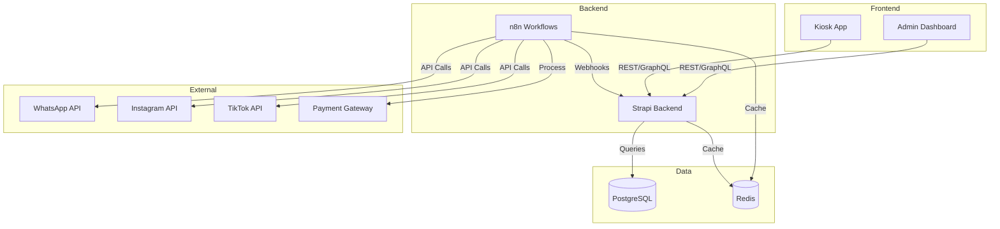

# Registry: Integrations

> **File**: `.obsidient/registry/integrations.md`
> **Purpose**: Cross-component integration mappings and data flow

---

## Integration Overview



---

## Integration Points

### 1. Admin Dashboard ↔ Strapi Backend

**Type**: REST API + GraphQL
**Data Flow**: Bidirectional

| Endpoint | Method | Purpose | Component |
|----------|--------|---------|-----------|
| `/api/orders` | GET/POST | Order management | admin-dashboard/src/services/orderApi.ts |
| `/api/menu` | GET | Menu retrieval | admin-dashboard/src/services/menuApi.ts |
| `/api/users` | GET/POST | User management | admin-dashboard/src/pages/Users.tsx |
| `/graphql` | POST | Complex queries | admin-dashboard/src/services/graphqlClient.ts |

**Obsidient Tracking**:
- API changes logged to: `decisions/api-changes/`
- Integration tests: Tracked in task files
- Breaking changes: Logged as DEC-XXX

---

### 2. Kiosk App ↔ Strapi Backend

**Type**: REST API
**Data Flow**: Bidirectional
**Special**: Offline-first with sync

| Endpoint | Method | Purpose | Component |
|----------|--------|---------|-----------|
| `/api/menu` | GET | Menu display | kiosk-app/src/menuService.ts |
| `/api/orders` | POST | Order placement | kiosk-app/src/orderService.ts |
| `/api/payments` | POST | Payment processing | kiosk-app/src/paymentService.ts |

**Obsidient Tracking**:
- Offline sync status: Logged in task context
- Payment flow: Tracked in decisions

---

### 3. n8n Workflows ↔ Strapi Backend

**Type**: Webhooks + API Calls
**Data Flow**: Bidirectional

| Trigger | Source | Action | Workflow |
|---------|--------|--------|----------|
| Order Created | Strapi Webhook | Process order | W4_CORE.json |
| Payment Received | Payment Gateway | Update order | W_PAYMENT.json |
| Menu Updated | Strapi Webhook | Clear cache | W_CACHE_INVALIDATE.json |
| Scheduled | Cron | Generate reports | W_REPORTS.json |

**Obsidient Tracking**:
- Workflow changes: Auto-logged on commit
- Error patterns: Tracked in task context
- Performance metrics: Logged in registry

---

### 4. WhatsApp Integration

**Type**: Webhook + API
**Data Flow**: Bidirectional

```
User Message → Meta Webhook → n8n (W4_CORE) → Strapi → Response
```

| Component | Integration Point | File |
|-----------|-------------------|------|
| Webhook Handler | n8n | workflows/W4_CORE.json |
| Message Parser | n8n | workflows/W_PARSER.json |
| Response Builder | n8n | workflows/W_RESPONSE.json |
| Order Creator | Strapi API | cms/src/api/order/controllers/ |

**Obsidient Tracking**:
- Integration status: Component registry
- Message flows: Decision logs
- Error handling: Task context

---

### 5. Redis Integration

**Type**: Cache + Queue
**Data Flow**: Multi-component

| Component | Usage | Key Pattern |
|-----------|-------|-------------|
| n8n | Workflow queue | `n8n:queue:*` |
| n8n | Execution data | `n8n:exec:*` |
| Strapi | Session cache | `strapi:session:*` |
| Strapi | Query cache | `strapi:query:*` |
| Admin Dashboard | API response cache | `admin:api:*` |

**Obsidient Tracking**:
- Cache invalidation: Logged in decisions
- Queue metrics: Component registry

---

### 6. PostgreSQL Integration

**Type**: Primary Database
**Data Flow**: All components write

| Component | Schema | Tables |
|-----------|--------|--------|
| Strapi | public | orders, menu_items, users |
| n8n | n8n | workflow, execution |
| Custom | analytics | events, metrics |

**Obsidient Tracking**:
- Schema migrations: Decision logs
- Query optimization: Task context
- Backup status: Project state

---

## Integration Health Matrix

| Integration | Status | Last Verified | Monitoring |
|-------------|--------|---------------|------------|
| Admin ↔ Strapi | 🟢 Healthy | Daily | Auto |
| Kiosk ↔ Strapi | 🟢 Healthy | Daily | Auto |
| n8n ↔ Strapi | 🟢 Healthy | Real-time | Auto |
| WhatsApp ↔ n8n | 🟡 Warning | Hourly | Manual |
| Redis Cache | 🟢 Healthy | Real-time | Auto |
| PostgreSQL | 🟢 Healthy | Real-time | Auto |

---

## Integration Testing

### Automated Tests

| Integration | Test Type | Frequency | Trigger |
|-------------|-----------|-----------|---------|
| Admin ↔ Strapi | E2E | On PR | CI/CD |
| Kiosk ↔ Strapi | E2E | On PR | CI/CD |
| n8n ↔ Strapi | Unit | On PR | CI/CD |
| WhatsApp | Integration | Daily | Scheduled |
| Redis | Health | Real-time | Monitoring |
| PostgreSQL | Health | Real-time | Monitoring |

### Test Locations

```
tests/
├── integration/
│   ├── admin-strapi.test.ts
│   ├── kiosk-strapi.test.ts
│   └── n8n-webhooks.test.ts
├── e2e/
│   ├── whatsapp-flow.spec.ts
│   └── order-journey.spec.ts
└── health/
    ├── redis-check.ts
    └── postgres-check.ts
```

---

## Integration Changes Log

### Recent Changes

| Date | Integration | Change | Decision | Impact |
|------|-------------|--------|----------|--------|
| 2026-04-04 | n8n ↔ Strapi | Added webhook validation | DEC-005 | Security |
| 2026-04-03 | Admin ↔ Strapi | Migrated to GraphQL | DEC-004 | Performance |
| 2026-04-02 | WhatsApp | Added retry logic | DEC-003 | Reliability |

---

## Failure Scenarios

### Scenario 1: WhatsApp Webhook Down

**Impact**: Orders via WhatsApp fail
**Detection**: n8n error workflow
**Response**:
1. Alert on-call (auto)
2. Switch to fallback (manual)
3. Log in Obsidient (auto)

### Scenario 2: Redis Cache Failure

**Impact**: Performance degradation
**Detection**: Health check
**Response**:
1. Fallback to database (auto)
2. Alert team (auto)
3. Investigate root cause (manual)

### Scenario 3: Strapi API Breaking Change

**Impact**: Frontend failures
**Detection**: E2E tests
**Response**:
1. Block deployment (auto)
2. Create task in Obsidient (auto)
3. Fix and re-test (manual)

---

## Integration Standards

### API Standards
- REST for CRUD
- GraphQL for complex queries
- Webhooks for real-time events
- All APIs versioned

### Data Standards
- ISO 8601 for dates
- snake_case for database
- camelCase for JavaScript
- PascalCase for TypeScript types

### Security Standards
- All endpoints authenticated
- Rate limiting on public APIs
- Input validation on all inputs
- Audit logging for sensitive operations

---

## Obsidient Integration

### Auto-Logging Events

| Event | Source | Obsidient Action |
|-------|--------|------------------|
| API Change | Code commit | Log to decisions |
| Integration Failure | Monitoring | Create task |
| Performance Degradation | Metrics | Update component |
| Schema Migration | Database | Log to decisions |

### Manual Documentation

- Architecture decisions: `decisions/DEC-XXX.md`
- Integration issues: Task context
- Performance tuning: Component registry

---

## Integration Roadmap

### Q2 2026
- [ ] Add TikTok Shop integration
- [ ] Implement event sourcing for orders
- [ ] Add real-time notifications (WebSockets)

### Q3 2026
- [ ] Multi-region deployment
- [ ] CDN integration for assets
- [ ] Advanced analytics pipeline

---

## Last Updated

- **Registry**: 2026-04-04T00:00:00Z
- **Version**: 1.0.0
