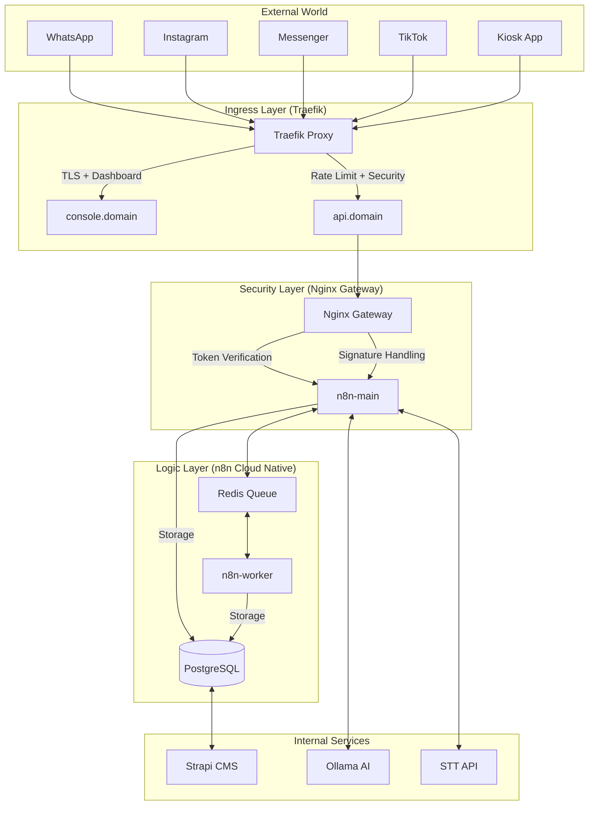

# Ralphé Global Architecture Map (v3.5.0)

## 🌟 Vision

A "God-Tier" omnichannel commerce engine for the Algerian market, built for performance, security, and multi-tenant scalability. Managed by a swarm of specialized AI agents.

## 🏗️ System Architecture

## Core Directory Structure

| Path | Purpose | Key Files |
| --- | --- | --- |
| `/` | Root | `docker-compose.hostinger.prod.yml`, `README.md`, `ENV_REFERENCE.md` |
| `/workflows` | n8n Logics (100+) | `W4_CORE.json`, `W1_IN_WA.json`, `W_QUEUE_METRICS.json`, `W_AUDIT_WRITE.json` |
| `/db` | Database | `bootstrap.sql`, `/migrations` (indexes, audit trail) |
| `/infra` | Infrastructure | `/gateway/nginx.conf`, `/redis/entrypoint.sh` |
| `/scripts` | Automation (20+) | `integrity_gate.sh`, `smoke-correlation.sh`, `verify-orders-indexes.sh` |
| `/docs` | Documentation (60+) | `RUNBOOK.md`, `ARCHITECTURE.md`, `ANTIFRAUD.md`, `CHANGELOG.md` |
| `/inventory-cms` | Strapi 5.37.1 CMS | `src/api/` (40+ content types), `config/logger.ts` |
| `/admin-dashboard` | React 19 Admin UI | `src/pages/AuditLogView.tsx`, `src/App.tsx` (lazy loading) |
| `/kiosk-app` | React 19 Kiosk | `src/services/menuService.ts` (5-min cache) |
| `/.planning` | GSD Roadmap | `PROJECT.md`, `ROADMAP.md`, `REQUIREMENTS.md`, `STATE.md` |

## Trust Boundaries

1. **Public/External**: Metadata/Webhook endpoints (Rate limited, Signature verified).
2. **Gateway**: Nginx filters out query tokens and unauthorized namespaces (`/v1/admin`, `/v1/internal`).
3. **Internal Network**: Docker network `internal` (Postgres/Redis/n8n) - No external port exposure.
4. **Admin Console**: BasicAuth + IP Allowlist for n8n UI and Adminer.

## Key Subsystems

- **L10N Engine**: Strict AR-out rules, Darija detection, message templates.
- **Trust & COD Engine**: No-show scoring, deposit calculation, payment intent state machine.
- **Driver Ecosystem**: OTP verification, dispatch logic, real-time availability.
- **Observability**: Correlation IDs (X-Request-ID), JSON structured logs, W_QUEUE_METRICS, W_REDIS_MONITOR.
- **Audit Trail**: workflow_audit table, W_AUDIT_WRITE/QUERY/ARCHIVE, AuditLogView admin page.
- **Performance**: DB indexes on orders, React lazy loading, kiosk menu caching (5-min TTL).
- **CI/CD**: 13 GitHub Actions workflows, integrity gate, smoke tests, deployment verification.

## Agent Swarm Map

- **Staff+ Engineer**: Orchestrator & Architect.
- **DevOps/SRE**: Infrastructure, CI/CD, Reliability.
- **Security**: Hardening, Secrets, Audit.
- **Automation**: n8n expert, workflow optimizer.

### Audit Readiness
