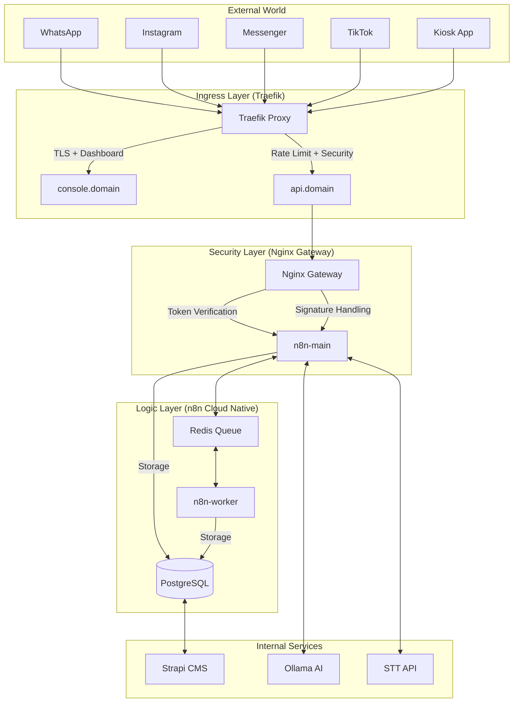

# 🗺️ Ralphé Global Architecture Map (v3.3.4+)

## 🌟 Vision

A "God-Tier" omnichannel commerce engine for the Algerian market, built for performance, security, and multi-tenant scalability. Managed by a swarm of specialized AI agents.

## 🏗️ System Architecture

## 📂 Core Directory Structure

| Path | Purpose | Key Files |
| --- | --- | --- |
| `/project` | Root | `docker-compose.hostinger.prod.yml`, `CLAUDE.md` |
| `/workflows` | n8n Logics | `W4_CORE.json`, `W1_IN_WA.json`, `W_DRIVER_BOT.json` |
| `/db` | Database | `bootstrap.sql`, `/migrations` |
| `/infra` | Infrastructure | `/gateway/nginx.conf` |
| `/scripts` | Automation | `integrity_gate.sh`, `test_battery.sh`, `smoke.sh` |
| `/docs` | Documentation | `RUNBOOK.md`, `ARCHITECTURE.md`, `ANTIFRAUD.md` |
| `/.claude` | Agent Intelligence | `SKILLS_INDEX.md`, `/skills/` |

## 🛡️ Trust Boundaries

1. **Public/External**: Metadata/Webhook endpoints (Rate limited, Signature verified).
2. **Gateway**: Nginx filters out query tokens and unauthorized namespaces (`/v1/admin`, `/v1/internal`).
3. **Internal Network**: Docker network `internal` (Postgres/Redis/n8n) - No external port exposure.
4. **Admin Console**: BasicAuth + IP Allowlist for n8n UI and Adminer.

## 🚀 Key Subsystems

- **L10N Engine**: Strict AR-out rules, Darija detection, message templates.
- **Trust & COD Engine**: No-show scoring, deposit calculation, payment intent state machine.
- **Driver Ecosystem**: OTP verification, dispatch logic, real-time availability.
- **Diamond CI/CD**: Release directories, atomic symlink cutover, health-gate deployments.

## 🧩 Agent Swarm Map

- **Staff+ Engineer**: Orchestrator & Architect.
- **DevOps/SRE**: Infrastructure, CI/CD, Reliability.
- **Security**: Hardening, Secrets, Audit.
- **Automation**: n8n expert, workflow optimizer.

### Audit Readiness
